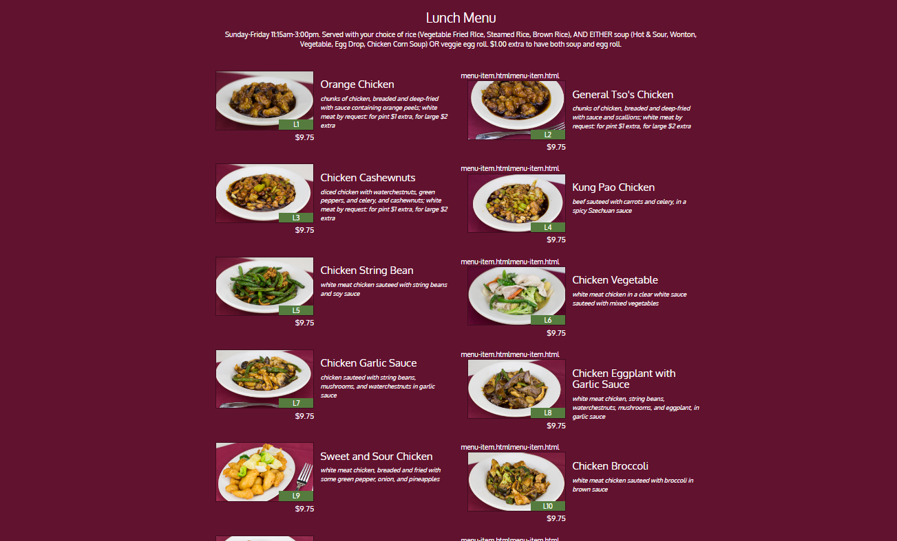

# David Chu's China Vistro

This is a website project for David Chu's China Vistro, created as part of a HTML, CSS, and JavaScript course on Coursera.

## Live Demo

Check out the live demo [here](https://anshhb.github.io/Restaurant-site/).

## Features

- Responsive design using Bootstrap
- Dynamic loading of menu categories and items using JavaScript and AJAX
- Integration with external APIs to fetch data

## Technologies Used

- HTML
- CSS (Bootstrap)
- JavaScript (AJAX)

## APIs Used

- [Categories API](https://coursera-jhu-default-rtdb.firebaseio.com/categories.json)
- [Menu Items API](https://coursera-jhu-default-rtdb.firebaseio.com/menu_items/)

## Screenshots

### Home Page


### Menu Categories Page


### Menu Items Page


### Special Food Items Page


## How to Run

1. Clone the repository:
   ```sh
   git clone https://github.com/your-username/Restaurant-site.git

2. Navigate to the project directory:

3. Open `index.html` in your browser to view the website.